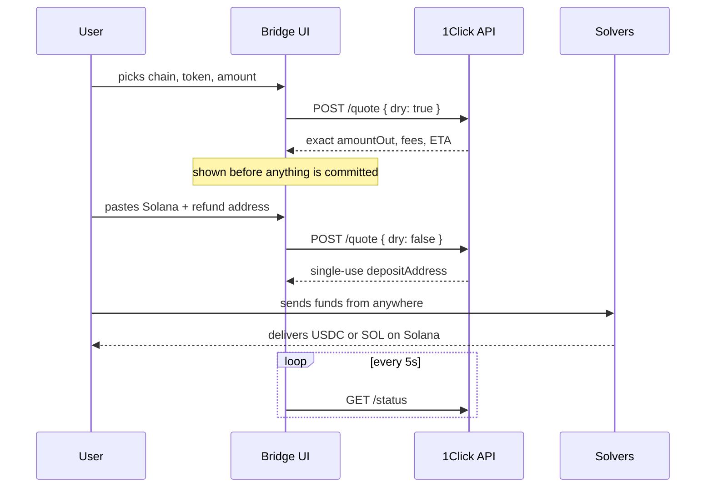

<h1 align="center">Architecture</h1>

<p align="center">
  How <a href="https://welcometosolana.xyz/">welcometosolana.xyz</a> moves assets
  to Solana, and why each part is shaped the way it is.
</p>

<p align="center">
  <a href="README.md">← Back to the README</a>
</p>

---

## Contents

- [The organising idea](#the-organising-idea)
- [Engine 1 — NEAR Intents, no wallet connect](#engine-1--near-intents-no-wallet-connect)
- [Engine 2 — Skip:Go over Cosmos](#engine-2--skipgo-over-cosmos)
- [How the two engines share one page](#how-the-two-engines-share-one-page)
- [Interface decisions](#interface-decisions)
- [Field notes](#field-notes)
- [Build and deploy](#build-and-deploy)

---

## The organising idea

A user knows one thing for certain: **where their money is right now.** They
do not know, and should not have to learn, whether that place is served by an
intent network or a Cosmos router.

So the interface asks only that one question. The three tabs are groupings of
source chains, and the engine is a consequence of the choice rather than part
of it. The words "NEAR Intents" and "Skip" appear nowhere in the flow — only
in the legal footer, where naming the independent networks that hold the funds
is the honest thing to do.

This collapses what looks like three products into two:

```
Ethereum & EVM ──┐
                 ├──→ Engine 1 (NEAR Intents)   same code, different defaults
Bitcoin & more ──┘
Cosmos ─────────────→ Engine 2 (Skip:Go)        the only genuinely different one
```

The practical payoff: adding a chain that 1Click supports takes no code at
all. Chains are classified by an EVM membership set, and anything unrecognised
falls into "Bitcoin & more" automatically.

---

## Engine 1 — NEAR Intents, no wallet connect

**Source:** [`site/assets/bridge.js`](site/assets/bridge.js) · vanilla, no build step.

### The flow



### Why a deposit address

The user sends to an address the way they would fund a centralised exchange.
No wallet connection, no signature, no approval transaction, and nothing for
a first-time user to get wrong beyond copying an address. It also means the
flow works identically from a hardware wallet, a phone, or an exchange
withdrawal screen.

### The dry quote

`dry: true` returns a full quote and **no deposit address**. It costs nothing
and commits to nothing, so the exact arrival amount is on screen before the
user has handed over anything.

This inverts the usual order. The prototype this replaced asked the user to
commit first and discover the rate afterwards. Quoting is debounced at 350ms
and guarded by a sequence number, so a fast typist's older responses cannot
overwrite a newer one.

Because a dry quote still validates the addresses it is handed, previews
before the user has typed one use a known-good throwaway address. Nothing is
reserved and no address is generated, so this cannot misdirect funds.

### One address, one transfer

Quote deadlines are checked **only at creation and then valid indefinitely**.
A deposit address therefore stays live long after its quote stopped
reflecting the market. An old address can still accept funds and fill at a
stale rate.

The interface never reuses one and says so plainly. Reserved orders are kept
in `localStorage` for resumption, but expire from the resume prompt after 24
hours — an order nobody funded within a day is far more likely abandoned than
pending, and offering to resume it forever is its own kind of trap.

### The token-account rent, surfaced

Delivering an SPL token to a wallet that has never held it requires opening a
token account, which costs about **$0.19 in rent, once**, charged out of the
transfer. A first-timer otherwise sees an arrival amount that looks simply
wrong.

One `getTokenAccountsByOwner` RPC call detects the case, and the interface
says so before the user commits. It is advisory: a failed lookup never blocks
the flow.

### Fee attribution

An authenticated call carries our fee recipient. Measured on a 100 USDC
transfer:

| Call | Arrives |
| --- | --- |
| Anonymous | 99.670 |
| Authenticated, no fee | 99.770 |
| Authenticated + 50bps | 99.270 |
| Authenticated + 100bps | 98.770 |

Two things follow. The fee attaches exactly linearly, and **authentication is
itself worth 10bps** — anonymous calls silently pay a default. Charging 0.5%
costs the user 0.4% against what an anonymous integration would have cost
them.

---

## Engine 2 — Skip:Go over Cosmos

**Source:** [`src/cosmos/engine.js`](src/cosmos/engine.js) · bundled, lazy-loaded.

Cosmos is the only leg that needs a wallet, because no deposit-address route
into Cosmos exists. We confirmed that directly with a major router. The
pragmatic answer: accept Keplr signing for this corridor only. Cosmos natives
already have wallets — the no-wallet promise mainly protects Solana
newcomers, who are not the people holding ATOM.

### The route

```
source chain → swap to USDC on Osmosis → IBC to Noble → Circle CCTP → Solana
```

Every signature is a Cosmos transaction, so Keplr alone is sufficient and
nothing is ever signed on Solana. This was proven end to end with real funds.

### The sweep

The design is driven by a single measured number: **leaving Cosmos costs a
flat $0.1938 regardless of size.** Verified across sizes — 3.00 → 2.8062,
5.00 → 4.8062, 8.00 → 7.8062.

Sending N assets directly pays that fee N times. So:

- **Phase A** routes every selected asset to USDC on **Noble**. Intra-Cosmos
  hops carry no CCTP fee.
- **Phase B** makes **one** exit to Solana, re-quoted against the balance that
  actually landed.

It engages at two or more assets; a single asset goes direct, because
sweeping it adds a signature to save nothing. The exit is capped at
`min(what this run gathered, what is actually on Noble)`, so USDC already
sitting on Noble is never spent.

If Phase A succeeds and Phase B fails, the money is USDC on Noble — safe and
resumable.

### Gas reserve: count transactions, not dollars

Every Cosmos hop is paid in that chain's own fee token, so sending a full
native balance leaves nothing to pay with and Keplr refuses to sign.

A flat USD reserve looks chain-agnostic and is anything but. $0.15 is eight
transactions on the Hub and roughly two hundred thousand on Neutron — the same
rule that barely protects one chain stranded **27% of a small balance** on
another.

The reserve is now `gas budget × transactions × the chain's own gas price`,
read from the router's registry. Three transactions: enough to retry a
failure, not enough to matter.

| Chain | Old flat reserve | Measured reserve |
| --- | --- | --- |
| ATOM | 0.1056 | **0.0300** |
| JUNO | 7.1579 | **0.0900** |
| TIA | 0.5003 | **0.0240** |

### Never pre-block on a guessed threshold

A `DUST_USD = 5` floor used to refuse small routes outright, on the theory
that the router would reject them. It refused **5 USDC** — valued at $4.9981,
since USDC prices slightly under a dollar — on a route that runs happily.

The router is the only authority on what the router will accept. It is now
always asked, and a refusal is explained rather than pre-empted.

---

## How the two engines share one page

The Cosmos engine needs a bundler: `@skip-go/client`, CosmJS and Node
polyfills. The NEAR engine is deliberately build-free. Rather than compromise
either, the page loads them differently.

```
site/index.html
  ├── site/assets/bridge.js     ← shell + NEAR engine, plain <script type="module">
  └── on first Cosmos tab click:
        dynamic import("cosmos-bridge-dist/cosmos-engine.js")
```

Three details make this work:

1. **The engine mounts, it does not own a page.** `src/cosmos/entry.js`
   injects the step markup into a host element and *then* imports the engine.
   The engine wires its listeners at module scope against ids it expects to
   already exist — which is exactly what let a 1,595-line working file move
   into a new host almost unchanged. Only its final two statements moved into
   an exported `init()`.

2. **The entry filename is fixed, not hashed.** `site/assets/bridge.js` imports it
   by name at runtime; a content hash would mean hand-editing that file after
   every build. The chunks it pulls in stay hashed, since nothing outside the
   bundle names them.

3. **Polyfills are imported statically, the engine dynamically.** Static
   imports are hoisted, so an engine imported statically would evaluate before
   `Buffer` exists — and the failure is invisible until transaction encoding,
   with Keplr having already signed.

The destination address travels between them in both directions. It is the
one value a user has to fetch from somewhere else, so asking twice because
they switched tabs is a real cost.

Two thirds of visitors never open the Cosmos tab, and none of them pay for
its bundle.

---

## Interface decisions

**Nothing is selected by default on the Cosmos leg.** Starting a transfer is
the user's call, not a default we made for them.

**The amount tracks the token.** An amount carried across a token change is
nonsense — 100 ETH becomes 100 BTC, roughly ten million dollars, with no
liquidity on any route. Until the user types their own figure, the amount
stays at roughly a hundred dollars of whatever is selected, rounded to
something a person would actually type. Once they type, it is theirs and
nothing overwrites it.

**Partial amounts are opt-in, and the field starts empty.** Prefilling it with
the balance meant typing "5" produced "5137.033099". It commits on blur or
Enter — clicking away is approval — and Escape cancels.

**Progress is measured in phases, not finished rows,** so one slow transfer
still shows movement. The sheen stops when nothing is in flight: an animation
outliving its work reads as a hang.

**Errors say whether money moved.** A raw `Bad status on response: 429` is
useless. Every client error is translated, and every quote-stage failure
leads with *"Nothing was sent."*

**The picker is ranked, not alphabetised.** Alphabetical put Abstract at the
top and Ethereum eleven rows down. Listed chains lead; unrecognised ones stay
alphabetical behind them, so a newly added chain appears without being given
a rank it has not earned.

**Mobile is not a narrower desktop.** The asset picker is a dialog on desktop
and a bottom sheet on a phone, anchored to the bottom edge so it sits under
the thumb. Search autofocuses only on desktop — on a phone it would raise the
keyboard over the sheet and hide the first result.

---

## Field notes

Things that cost real debugging time, recorded so they cost nobody else any.

**`chain_ids` accepts one id, not a list.** Asking a Skip endpoint for several
chains at once returns an **empty map with HTTP 200** — no error at all. Every
balance rendered as a raw `ibc/…` hash. Fetch one chain per request, in
parallel, and assume this of every endpoint taking `chain_ids`.

**Affiliate configuration is global API state, not a per-call argument.** It
must be re-set to match each route before that route runs, *and*
`allowOptionsUpdateAfterApiCall: true` is required — without it options freeze
after the first API call and the fee silently never applies.

**The router ships no RPC endpoints in its chain registry.** Supplying them
explicitly is mandatory or every signature dies.

**One public RPC host behind every signature is a single point of failure.**
`rpc.cosmos.directory` caps around 300 requests/minute per IP and tripped
mid-run as a 429 — sometimes *after* the user had approved. Now two providers,
probed and cached per chain, and only successes are cached.

**`enable([...ids])` is all-or-nothing in Keplr.** One unknown chain id
rejects the whole batch *before any prompt appears*, so it reads to the user
as "you declined". Core chains are requested as one batch; less certain ones
individually, with failures ignored.

**Never send 100% of a native fee token.** Keplr refuses to sign it.

**`/v0/status` 404s until the indexer sees a fresh address.** That is the
normal state before a first deposit, not an error, and must not be painted as
one.

**`base: "./"` is mandatory in the Vite config,** or built assets collide with
the site's own `/assets/` directory.

**QR encoding was vendored, not written.** A hand-rolled encoder scored 0/6
against an independent decoder and was abandoned;
[qrcode-generator](https://github.com/kazuhikoarase/qrcode-generator) v2.0.4
(MIT) scored 8/8 across EVM, Solana, BTC, Cosmos, Tron and Doge payloads,
verified by decoding the page's own output with OpenCV. One trap inside it:
`String.replace` expands `$'` in the replacement string and the library
contains `case '$'`, so it must be inlined by concatenation.

---

## Build and deploy

```bash
npm run build             # both engine bundles, into site/
npm run build:cosmos      # Cosmos engine  -> site/cosmos-bridge-dist/
npm run build:near-widget # embedded widget -> site/near-widget-dist/
npm run dev:cosmos        # Cosmos dev server on :5180, opens the harness
npm run serve             # serve site/ on :8899
```

[`.github/workflows/pages.yml`](.github/workflows/pages.yml) builds both
bundles and deploys the assembled site to GitHub Pages on every push to
`main`. Built output is not committed: it was about 150 content-hashed files
that churned completely on each rebuild, and building at deploy time
guarantees the deployed bundles match the source beside them.

The site itself is static. There is no server, no database and no backend —
which is also the reason the custody position is simple to state and simple
to verify.
