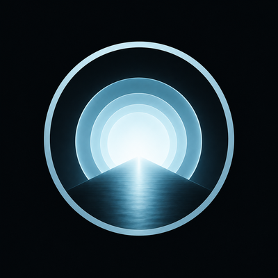
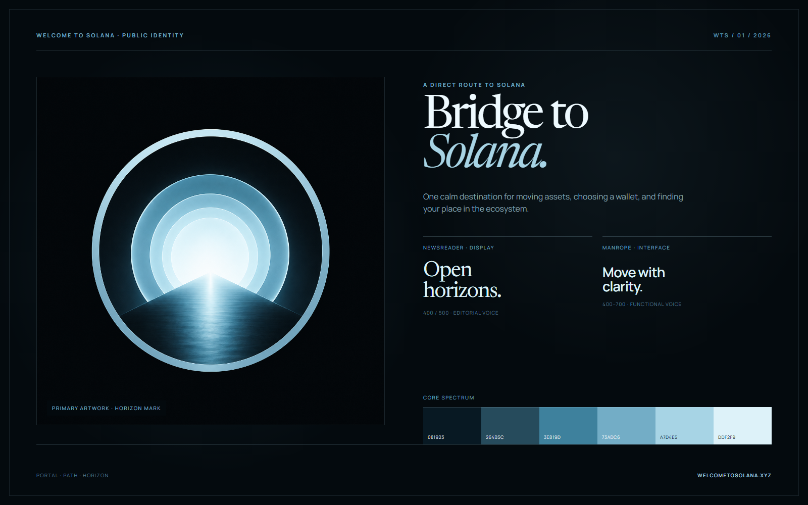
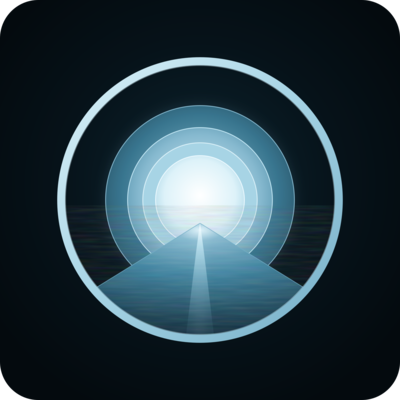

<p align="center">
  
</p>

<h1 align="center">Welcome to Solana brand book</h1>

<p align="center">
  The public visual system for a clear route into Solana.
</p>

<p align="center">
  <a href="https://welcometosolana.xyz/">Live website</a> ·
  <a href="#logo-system">Logo system</a> ·
  <a href="#typography">Typography</a> ·
  <a href="#color">Color</a> ·
  <a href="brand/">Download assets</a>
</p>

<p align="center">
  
</p>

## Brand premise

**Welcome to Solana is a direct route from 50+ source chains to one destination: Solana.** The website helps people choose a wallet, move assets from Ethereum, Cosmos, Bitcoin and 30+ other chains through one interface, review the exact amount that will arrive, and discover communities and applications once they get there.

The identity turns that journey into a simple visual idea: **portal, path, horizon**. It should feel calm enough for a first-time user, precise enough for a transaction interface, and optimistic without becoming promotional hype.

| Character | Expression |
| --- | --- |
| Clear | One primary message or action at a time |
| Welcoming | Plain language, useful context, no assumed expertise |
| Calm | Space, hierarchy, and restrained motion |
| Credible | Specific information without urgency or exaggeration |
| Human | Community and creators remain visible |

## Logo system

<table>
  <tr>
    <td width="50%" align="center"></td>
    <td width="50%" align="center"></td>
  </tr>
  <tr>
    <td><strong>Primary artwork</strong><br/>Profiles, social, press, and large editorial placements.</td>
    <td><strong>Production mark</strong><br/>Interfaces, navigation, partners, print, and motion.</td>
  </tr>
</table>

The supplied atmospheric PNG is the canonical visual reference. The native SVG is a production interpretation built from vector geometry; it does not embed a bitmap. Use the simplified favicon at tiny sizes rather than shrinking the textured artwork.

### Clear space and minimum size

- Keep clear space equal to **10% of the mark's width** on every side.
- Use the primary artwork at **96 px or larger**.
- Use the vector mark at **40 px or larger**.
- Use the simplified favicon between **16–32 px**.
- Preserve the square canvas and original aspect ratio.

### Never

- Stretch, crop, rotate, skew, or rearrange the mark.
- Remove rings or move the path away from the center.
- Add unrelated gradients, shadows, slogans, badges, or outlines.
- Place the full-color mark over a busy or low-contrast image.
- Substitute Solana's corporate wordmark for the Welcome to Solana name.

## Typography

Typography is part of the public website identity—not an internal recommendation. The production homepage loads both families from Google Fonts.

| | Family | Role | Approved weights |
| --- | --- | --- | --- |
| **Aa** | [Newsreader](https://fonts.google.com/specimen/Newsreader) | Headlines, hero statements, pull quotes, large numbers | 400, 500; short italic emphasis |
| **Aa** | [Manrope](https://fonts.google.com/specimen/Manrope) | Body copy, navigation, buttons, labels, captions, data | 400, 500, 600, 700 |

### Newsreader — editorial voice

Use compact line-height (`0.9–1.05`) and restrained negative tracking (`-0.03em` to `-0.05em`) for display sizes. Italics are for brief emphasis, not paragraphs.

```css
font-family: "Newsreader", Georgia, serif;
```

### Manrope — functional voice

Use 400–500 for reading text and 600–700 for navigation or compact labels. Uppercase labels may use `0.12em–0.18em` letter spacing.

```css
font-family: "Manrope", "Helvetica Neue", Arial, sans-serif;
```

Write the name as **Welcome to Solana**. When a text wordmark is needed, typeset it in Manrope 700; do not join the words or alter the capitalization.

## Color

The palette uses a dark ocean foundation with one concentrated frost-cyan light system.

| Token | Hex | Use |
| --- | --- | --- |
| Night | `#040A0E` | Primary background |
| Deep Ocean | `#081923` | Raised dark surfaces and path |
| Ocean | `#264B5C` | Dark structure |
| Horizon | `#3E819D` | Rings and supporting accents |
| Current | `#73ADC6` | Interactive and illustrative accents |
| Frost | `#A7D4E5` | Primary brand accent |
| Ice | `#DDF2F9` | Highlights and light-on-dark text |

Frost and Ice may carry emphasis on Night. Do not use Horizon for small text on dark surfaces; reserve it for large shapes and decorative structure.

## Voice

- Lead with what someone can do, not ecosystem terminology.
- Explain risk at the point of action: token, amount, destination, address, fees, and minimum received.
- Avoid price promises, artificial urgency, inflated claims, and insider language.
- Credit communities, creators, and providers clearly.

## Accessibility

- Meet WCAG AA contrast: 4.5:1 for normal text and 3:1 for large text.
- Never communicate a state with cyan alone; add a label, icon, or shape.
- Use `Welcome to Solana` as linked-logo alternative text.
- Use empty alternative text for purely decorative logo instances.
- Preserve a visible keyboard focus indicator around linked marks.

## Asset source of truth

All approved exports live in [`brand/`](brand/). The canonical artwork was supplied by the Welcome to Solana project on 17 August 2026. The vector and favicon files were constructed from that approved reference for production use.
