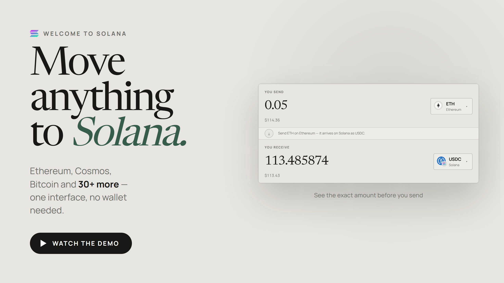
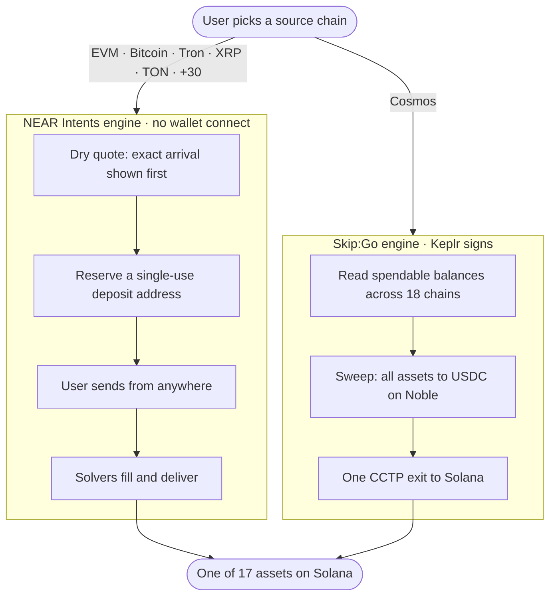

<div align="center">


# Welcome to Solana

**One interface that moves assets to Solana from 50+ chains —<br/>including the corridors nothing else covers.**

[](https://welcometosolana.xyz/)
[](LICENSE)
[](#security--custody)
[](#architecture)

[**Open the site ↗**](https://welcometosolana.xyz/) · [**Watch the demo ↗**](https://youtu.be/TmEUH0MiYB8) · [Architecture](ARCHITECTURE.md) · [Brand book](BRAND.md) · [Terms](site/terms.html)

<br/>

<!-- GitHub strips iframes, so the demo is a thumbnail that links out. -->
<a href="https://youtu.be/TmEUH0MiYB8">
  
</a>

<sub><b><a href="https://youtu.be/TmEUH0MiYB8">▶ Watch the demo</a></b> — the bridge end to end</sub>

<br/><br/>


</div>

---

## What this is

Someone who decides to try Solana has to solve a logistics puzzle first. Their
assets are on Ethereum, or Bitcoin, or Cosmos, and each needs a different
bridge, a different wallet, and a different set of things that can go wrong.

This is one interface over all of it. **You pick where your assets are. It
picks how to move them.** The routing engine behind that choice is never
something you have to learn.

|  | Chains | Wallet needed | How it works |
| --- | --- | --- | --- |
| **Ethereum & EVM** | 14 | none | You get a deposit address and send to it, like funding an exchange |
| **Bitcoin & more** | 20 | none | Same flow, same code path — BTC, Tron, XRP, TON, Sui, Doge… |
| **Cosmos** | 18 | Keplr | Sign once per chain; the swap, bridge and delivery run unattended |

You can receive **17 different Solana assets**, and we never touch your funds.

<details>
<summary><b>Why is Cosmos the interesting one?</b></summary>

<br/>

Because it is the corridor that does not otherwise exist. We confirmed
directly with a major router: *"Cosmos doesn't have any deposit address flows
supported."* NEAR Intents lists **zero** Cosmos assets. For an ATOM or TIA
holder, the honest alternative today is a round trip through a centralised
exchange.

The path that works needed real engineering, not integration. Leaving Cosmos
costs a **flat relay fee regardless of transfer size** — measured at $0.1938,
identical whether you move $3 or $8. Send five assets directly and you pay it
five times. So two or more assets are first swept into USDC on Noble, where
intra-Cosmos hops carry no such fee, and then leave in a single exit.

The effect is not marginal. A **$1.15 TIA balance was refused** as a direct
route to Solana; swept to Noble first it came back as **$1.16**.

</details>

---

## Quick start

```bash
git clone https://github.com/Medniyy/welcometosolana.git
cd welcometosolana
npm install
npm run build      # builds the two engine bundles into site/
npm run serve      # http://localhost:8899
```

No API keys are required to run this.

<details>
<summary><b>All commands</b></summary>

<br/>

| Command | What it does |
| --- | --- |
| `npm run build` | Both engine bundles → `site/` |
| `npm run build:cosmos` | Cosmos engine only → `site/cosmos-bridge-dist/` |
| `npm run build:near-widget` | Embedded widget → `site/near-widget-dist/` |
| `npm run dev:cosmos` | Cosmos engine dev server on `:5180`, opens the harness |
| `npm run serve` | Serve `site/` statically |
| `npm run revenue` | Completed volume and fees, read from the chains |
| `npm run dashboard` | The same, as a page — `http://127.0.0.1:8877/dashboard.html` |

`src/cosmos/spike.html` on the dev server is a no-UI route diagnostic — the
instrument to re-run whenever a route stops behaving.

</details>

<details>
<summary><b>Repository layout</b></summary>

<br/>

Everything served to the public lives in `site/`. Everything else does not.
That single rule is why the deploy workflow has no exclude list to maintain.

```
.
├── site/                      # ← everything that gets deployed
│   ├── index.html             #   homepage; the bridge is section 02
│   ├── routes.html            #   third-party routers, kept reachable
│   ├── terms.html             #   terms of use & risk disclosure
│   ├── ecosystem-new.html     #   JSON-driven Solana directory
│   ├── assets/
│   │   ├── bridge.js          #   bridge shell + the NEAR Intents engine
│   │   ├── bridge.css         #   one stylesheet, both engines
│   │   ├── consent.js         #   first-visit terms gate
│   │   ├── chains/  tokens/   #   marks we ship ourselves
│   │   └── vendor/qrcode.js   #   qrcode-generator v2.0.4 (MIT), vendored
│   └── data/ecosystem.json
│
├── src/                       # ← source that gets built, never served raw
│   ├── cosmos/
│   │   ├── engine.js          #   the Cosmos engine
│   │   ├── entry.js           #   mount entry, lazy-imported on first use
│   │   ├── markup.js          #   its step markup
│   │   ├── harness.html       #   the engine on a page of its own
│   │   └── spike.html         #   no-UI route diagnostic
│   ├── near/                  #   the embedded Aurora widget
│   └── polyfills.js           #   Node globals the Cosmos stack assumes
│
├── brand/                     # logo system and downloadable assets
└── .github/workflows/         # build + deploy to GitHub Pages
```

</details>

---

## Architecture



Three tabs, **two engines**. Ethereum/EVM and Bitcoin/more are the same code
path with different defaults, which is why this is one flow and not three.

**[Read the full architecture →](ARCHITECTURE.md)** — including the field notes
on every gotcha that cost real debugging time.

<details>
<summary><b>How does the interface stay this small?</b></summary>

<br/>

There is no server, no database, and no backend. The site is static HTML, CSS
and vanilla JavaScript; only the two routing engines need a build.

| | |
| --- | --- |
| Site | Static HTML/CSS/JS, no framework |
| EVM + non-EVM routing | [NEAR Intents 1Click](https://near-intents.org) REST API, called directly |
| Cosmos routing | [`@skip-go/client`](https://github.com/skip-mev) + Keplr |
| Settlement into Solana | Circle CCTP via Noble |
| Build / deploy | Vite → GitHub Actions → GitHub Pages |

The NEAR engine is deliberately **build-free vanilla JavaScript**. It is the
part intended to become embeddable elsewhere, and a build step would make that
a much larger ask.

The Cosmos engine is fetched **only when someone opens that tab** — two thirds
of visitors never do, and none of them pay for its bundle.

</details>

<details>
<summary><b>How does a transfer actually work?</b></summary>

<br/>

**Without a wallet (EVM, Bitcoin, and 30+ others)**

1. You choose a chain, token and amount. A `dry` quote prices it immediately —
   it costs nothing and commits to nothing, so **the exact arrival amount is on
   screen before you hand over anything**.
2. You give a Solana address and a refund address on the sending chain.
3. The routing network issues a **single-use deposit address**.
4. You send to it from anywhere — wallet, hardware device, exchange withdrawal.
5. Solvers fill and deliver. The page polls status until it lands.

**With Keplr (Cosmos)**

1. Connect. One approval covers every chain we check, read-only.
2. Pick assets from your real balances. Nothing is selected by default.
3. Review the quote, then sign — once per chain, not once per asset.
4. Two or more assets are swept into USDC on Noble first, then leave together.

</details>

<details>
<summary><b>What does it cost?</b></summary>

<br/>

A **0.5% service fee** is included in every quote shown, waived below $20 on
the Cosmos leg. It is disclosed in the interface, not buried.

Measured all-in cost on completed transfers: **0.21%–1.39%**, depending mostly
on size, because the fixed costs do not shrink.

One counter-intuitive measurement worth publishing: an authenticated call to
1Click *removes* the 10bps default that anonymous calls silently pay. On a
100 USDC transfer:

| Call | Arrives |
| --- | --- |
| Anonymous | 99.670 |
| Authenticated, no fee | 99.770 |
| Authenticated + 50bps | 99.270 |

So charging 0.5% costs the user **0.4% against what an unauthenticated
integration would have cost them**.

</details>

---

## Status

Honest about what is proven and what is not.

| | |
| --- | --- |
| EVM → Solana | ✅ **Verified with real funds** |
| Bitcoin / Tron / other non-EVM → Solana | ✅ Same code path and API |
| Cosmos → Solana, single asset | ✅ **Verified with real funds** — ATOM, Cosmos Hub → Osmosis → Noble → CCTP → Solana |
| Cosmos multi-asset sweep | ✅ **Verified with real funds** |
| Cosmos gas top-up | ⚠️ Built; not yet run end to end |

<details>
<summary><b>Known limitations</b></summary>

<br/>

- Cosmos signing is sequential and waits for each relay. It should group by
  chain and run chains in parallel — same-chain transfers must stay sequential
  or sequence numbers collide.
- One signature per chain is the floor. A Cosmos transaction is signed for one
  chain by one account, so assets spread across three chains means three
  signatures. Batching multiple messages per chain would reduce it to one per
  chain; delegating further would mean holding a key, which we will not do.
- Whether the relay opens a missing Solana token account is unverified. The
  interface detects the case and warns about the one-time ~$0.19 rent.
- Gas can only be paid in a denomination the router's registry lists as a fee
  asset for that chain — what the chain itself accepts is irrelevant.
- Two of the 17 Solana assets have no logo in any public registry and fall back
  to a monogram.

</details>

---

## Security & custody

**We never take custody.** There is no server and no key. Deposit addresses are
generated by the routing network, not by us — we cannot access, reverse, or
recover a transfer, and that is a property of the design rather than a policy.

- The Cosmos leg reads balances only; nothing moves without an explicit
  signature per transaction.
- Wallet connection is optional everywhere and read-only — used to fill in an
  address, never to sign.
- Addresses are shape-checked client-side before a quote is spent on them.
- A deposit address is **single-use**, and the interface says so.
- The client-side API key is a distribution-channel token whose only powers are
  routing and fee attribution.

Found something? Open an issue, or reach us on [Telegram](https://t.me/+3prPanTSreIwMzMy).

---

## Contributing

Issues and pull requests are welcome. The codebase has two rules worth knowing
before you start:

1. **Anything served lives in `site/`.** Anything else does not.
2. **Comments explain why, not what.** Most of the non-obvious code in here
   exists because something failed in a specific way — say which.

Run `npm run build` and load the site before opening a PR. There is no test
suite yet; the [field notes](ARCHITECTURE.md#field-notes) are the closest thing
to a regression list.

---

<div align="center">

### Built by

**[Vali](https://x.com/validotxyz)** · **[Tom](https://x.com/Frame_tailor_)** · at **[ATH](https://ath.camera/)**

[Website](https://welcometosolana.xyz/) · [Telegram](https://t.me/+3prPanTSreIwMzMy) · [X](https://x.com/validotxyz) · [ATH](https://ath.camera/)

<br/>

Community-made. Provider links are not endorsements. Nothing here is financial
advice. Blockchain transactions are final — always review the token, amount,
destination network, receiving address, fees and minimum received before you
send.

[MIT licensed](LICENSE) · brand assets reserved

</div>
